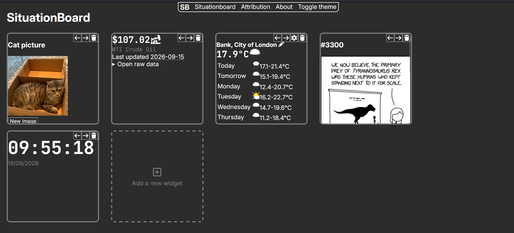
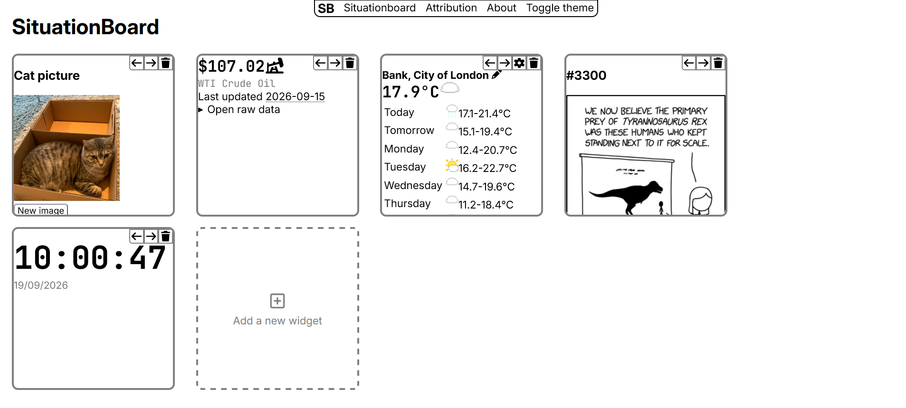

# SituationBoard

[](https://situationboard.nouxinf.net/)

**SituationBoard** is a website that lets you view info at a glance through widgets on a new tab page.

## Screenshots

<div align="center">
  
  <br/>
  <em>Dark mode</em>
  <br/>
  
  <br/>
  <em>Light mode</em>
</div>

## How to use

Just go to [the website](https://situationboard.nouxinf.net/) and start adding widgets by pressing "Add a new widget". It's a WIP project so there aren't many widgets yet, but read on to find out how you can add more!

## Contributing

In order to contribute to SituationBoard your contribution must meet the following requirements:

- Follows rules in `.prettierrc`
- If code is AI generated you must be able to explain what it does and how it works

### Adding a new widget

If it doesn't need a backend then just make a new `.js` file named after your widget in `public/`. Here is a boilerplate widget that has the bare minimum to start with.

```js
function initTestWidget(container) {
	container.innerHTML = /* HTML */ `
		<div class="widget-controls">
			<button
				class="widget-control move-left"
				title="Move left"
			></button>
			<button
				class="widget-control move-right"
				title="Move right"
			></button>
			<button
				class="widget-control delete-widget"
				title="Delete"
			></button>
		</div>
		<h3>Test</h3>
	`;
	const instanceId = container.dataset.instanceId;
	moveLeftHandler = () => moveWidgetLeft(instanceId);
	moveRightHandler = () => moveWidgetRight(instanceId);
	deleteHandler = () => deleteWidget(instanceId);

	container
		.querySelector(".move-left")
		.addEventListener("click", moveLeftHandler);
	container
		.querySelector(".move-right")
		.addEventListener("click", moveRightHandler);
	container
		.querySelector(".delete-widget")
		.addEventListener("click", deleteHandler);
}

function destroyTestWidget(container) {
	container
		.querySelector(".move-left")
		?.removeEventListener("click", moveLeftHandler);
	container
		.querySelector(".move-right")
		?.removeEventListener("click", moveRightHandler);
	container
		.querySelector(".delete-widget")
		?.removeEventListener("click", deleteHandler);

	moveLeftHandler = moveRightHandler = deleteHandler = null;
}
```

And add it in `index.html` **above `widget.js`**:

```html
<script src="test.js"></script>
```

You should generally use `container.querySelector()` and classes to refer to elements in your widget.

To add this in you'll then need an entry in `widget.json` along with an SVG icon, preferably from [FontAwesome](https://fontawesome.com/). Add something like:

```js
	{
		"name": "test",
		"icon": "test.svg",
		"colour": "grey",
		"description": "# Test\n",
		"id": "test"
	}
```

If you want to add something that requires a backend however e.g. an API that needs an API key or doesn't work right in the browser then add a new file for it in `routes/`. Follow `xkcd.js` as an example and make sure you import it in `index.js`.

## Self hosting

You can self host SituationBoard fairly easy by just cloning the repo, then running:

```bash
npm i
node index.js
```
